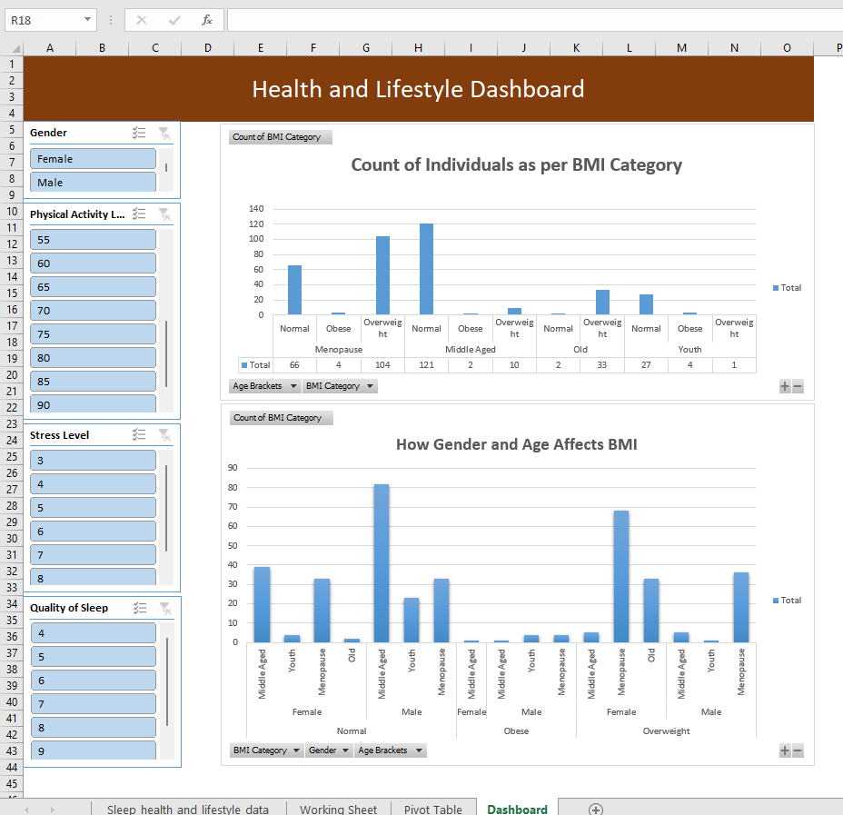

# Sleep-Health-Lifestyle-Analysis-Excel-Project

This project explores how age, gender, BMI, and lifestyle factors such as stress, physical activity, and sleep quality interact to impact health. Using Excel's data analysis and visualization capabilities, I cleaned, transformed, and visualized a dataset sourced from Kaggle to uncover trends — especially focusing on **BMI distribution across different age groups and genders**.

## 📊 Project Overview

### ✅ Data Source

- **Source:** [Kaggle](https://www.kaggle.com/)
- **Dataset:** Sleep, Health, and Lifestyle Data
- **Format:** CSV

---

## 🧹 Data Cleaning & Preparation

The dataset was cleaned and prepared using the following steps:

- Removed duplicate entries  
- Handled outliers  
- Filled or removed null values  
- Added categorized and filtered columns:
  - **Age brackets:** Youth, Middle Age, Menopause (40+), Old  
  - **BMI categories:** Normal, Overweight, Obese  

---

## 📈 Key Pivot Tables & Analysis

### 1. Age Bracket vs BMI Category

- Shows the number of people in each age group who fall into Normal, Overweight, or Obese BMI categories  
- Helps visualize general health patterns across life stages  

### 2. Age Bracket + BMI Category + Gender

- Designed to highlight how **women aged 40+** (menopausal group) show increased rates of being overweight or obese  
- Supports scientific claims about hormonal and metabolic changes post-menopause  

---

## 📊 Interactive Dashboard

The dashboard is fully interactive using Excel **PivotTables** and **Slicers**.  
It includes **4 slicers** connected to both pivot tables for dynamic filtering:

- Gender  
- Physical Activity Level  
- Stress Level  
- Quality of Sleep  

These slicers allow users to gain tailored insights based on specific demographics and lifestyle habits.

---

## 🎯 Goals & Insights

- Understand how lifestyle affects BMI and general health  
- Confirm scientific observations such as:  
  - Metabolic changes post-40 in women  
  - The relationship between stress, sleep, and body weight  

---

## 📁 Files Included

- `Sleep_Health_Lifestyle_Cleaned.xlsx` – Cleaned dataset with added categorical columns  
- `Sleep_Health_Analysis_Dashboard.xlsx` – Pivot tables and dashboard with slicers  
- `README.md` – This documentation 

---

## 📬 Contact

For questions, collaboration, or suggestions:  
📧 grayceehiuko@gmail.com 
🔗(https://www.linkedin.com/in/grayceehiuko/)
